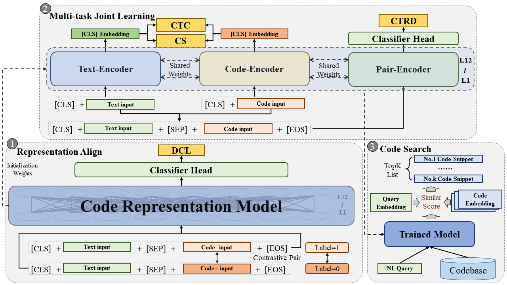

# HedgeCode: A Multi-Task Hedging Contrastive Learning Framework for Code Search

> *HedgeCode* consists of three stages. It aligns the representation spaces of code and text in the first stage and then further optimizes the representation learning in the second stage. Finally, it uses the trained model for code search.



> In the representation alignment stage, we align the representation spaces of code and text through a relevance detection task and design hedging contrastive learning (HCL) method to capture fine-grained differences between the code and text. In the multi-task joint learning stage, we employ joint learning to optimize the code-text relevance detection task (CTRD), code-text contrastive learning task (CTC), and code search task (CS). In the code search stage, we employ the trained encoder to search codes from the codebase.

## Source Code


#### Environment
```bash
conda env create -f env-hedgecode.yaml
conda activate hedgecode
```

#### Dataset

> Two datasets were used in the experiments. Data statistics of these two datasets are as follows:

**Data statistic of CodeSearchNet.**

| PL         | Training | Validation  |  Test  | Candidate Codes|
| :--------- | :------: | :----: | :----: |:----: |
| Ruby       |  24,927  | 1,400  | 1,261  |4,360|
| JavaScript |  58,025  | 3,885  | 3,291  |13,981|
| Java       | 164,923  | 5,183  | 10,955 |40,347|
| Go         | 167,288  | 7,325  | 8,122  |28,120|
| PHP        | 241,241  | 12,982 | 14,014 |52,660|
| Python     | 251,820  | 13,914 | 14,918 |43,827|

**Data statistic of Relevance Detection Pairs.**

| PL         | Training | Validation  |  Test  |
| :--------- | :------: | :----:  | :----: |
| Ruby       |  74,781  |   4,200 | 3,783   |
| JavaScript | 17,4075  |  11,655 | 9,873   |
| Java       |  494,769 |  15,549 | 32,865  |
| Go         |  501,864 | 21,975  | 24,366  |
| PHP        |  723,723 | 38,946  |  42,042 |
| Python     |  755,460 |  41,742 |  44,754 |

* Please refer to the [README.md](./dataset/README.md) in the dataset folder for more details of datasets.

#### Model Training

##### Encoder
HedgeCode is a model-agnostic framework. Any transformer-based code large language model (code LLM) can be integrated as an encoder. In this study, we integrated three wildly used code LLMs as encoders respectively ([CodeBERT](https://huggingface.co/microsoft/codebert-base), [Unixcoder](https://huggingface.co/microsoft/unixcoder-base), and [CoCoSoDa](https://huggingface.co/DeepSoftwareAnalytics/CoCoSoDa)).
##### Training and Evaluation
HedgeCode main has two training stages: Representation Alignment Stage and Multi-task Joint Learning Stage. 
###### 1. Representation Alignment Stage 

> Detector Training.

~~~bash
cd ./RA

python representation_alignment.py --language=ruby --output_dir=./save_results --detection_dir="../dataset/detection dataset" --encoder=codebert --nl_length=128 --code_length=256 --loss_type=hcl --batch_size=64 --learning_rate=1e-6 --num_train_epochs=100
~~~

###### 2. Multi-task Joint Learning Stage 

> Training with CodeBERT.

```bash
cd ./MJL/HedgeCode_CodeBERT

lang=ruby
mode=hcl
mkdir -p ./saved_models/$lang/$mode

python run.py --output_dir=./saved_models/$lang/$mode --config_name=microsoft/codebert-base --model_name_or_path=microsoft/codebert-base --tokenizer_name=microsoft/codebert-base --do_train --do_eval --do_test --train_data_file=../../dataset/codesearchnet/$lang/train.jsonl --eval_data_file=../../dataset/codesearchnet/$lang/valid.jsonl --test_data_file=../../dataset/codesearchnet/$lang/test.jsonl --codebase_file=../../dataset/codesearchnet/$lang/codebase.jsonl --detector_path="../../RA/save_results/$lang/codebert/$mode/detector.pth" --num_train_epochs=100 --code_length=256 --nl_length=128 --train_batch_size=64 --eval_batch_size=64 --learning_rate=2e-5 --seed=123456 --fewshot=False 2>&1 | tee saved_models/$lang/$mode/train.log
```

> Training with Unixcoder.

```bash
cd ./MJL/HedgeCode_Unixcoder

lang=ruby
mode=hcl
mkdir -p ./saved_models/$lang/$mode

python run.py --output_dir=./saved_models/$lang/$mode --config_name=microsoft/unixcoder-base --model_name_or_path=microsoft/unixcoder-base --tokenizer_name=microsoft/unixcoder-base --do_train --do_eval --do_test --train_data_file=../../dataset/codesearchnet/$lang/train.jsonl --eval_data_file=../../dataset/codesearchnet/$lang/valid.jsonl --test_data_file=../../dataset/codesearchnet/$lang/test.jsonl --codebase_file=../../dataset/codesearchnet/$lang/codebase.jsonl --detector_path="../../RA/save_results/$lang/unixcoder/$mode/detector.pth" --num_train_epochs=100 --code_length=256 --nl_length=128 --train_batch_size=64 --eval_batch_size=64 --learning_rate=2e-5 --seed=123456 --fewshot=False 2>&1 | tee saved_models/$lang/$mode/train.log
```

> Training with CoCoSoDa.

~~~bash
cd ./MJL/HedgeCode_CoCoSoDa

lang=ruby
mode=hcl

bash run.sh $lang $mode
~~~


#### Zero-shot and Few-shot code search

##### zero-shot with detector

> First, recall the topN code from the codebase with ball-tree.

~~~bash
cd ./RA/zero-shot

lang=ruby

python recall_topn.py --language=$lang --output_dir=./zero-shot/$lang --query_file="../../dataset/detection dataset/pairs/$lang/test.jsonl" --codebase_file="../../dataset/codesearchnet/$lang/codebase.jsonl" --plugin_checkpoint_path="../save_results/$lang/codebert/hcl/detector.pth" --encoder=codebert --batch_size=1024 --topK=1000
~~~

> Then, adopt the trained detector to search the code from codebase.

~~~bash
lang=ruby

python zero_shot_search.py --language=$lang --output_dir=./zero-shot/$lang --pair_dataset_file="./zero-shot/$lang/detection_pair_dataset.jsonl" --plugin_checkpoint_path="../save_results/$lang/codebert/hcl/detector.pth" --encoder=codebert --batch_size=5120 --topK=1000
~~~

##### few-shot code search

>Train with CodeBERT.

~~~bash
cd ./MJL/HedgeCode_CodeBERT

lang=ruby
mode=hcl
mkdir -p ./saved_models/$lang/$mode/fewshot

python run.py --output_dir=./saved_models/$lang/$mode/fewshot --config_name=microsoft/codebert-base --model_name_or_path=microsoft/codebert-base --tokenizer_name=microsoft/codebert-base --do_train --do_eval --do_test --train_data_file=../../dataset/codesearchnet/$lang/train.jsonl --eval_data_file=../../dataset/codesearchnet/$lang/valid.jsonl --test_data_file=../../dataset/codesearchnet/$lang/test.jsonl --codebase_file=../../dataset/codesearchnet/$lang/codebase.jsonl --detector_path="../../RA/save_results/$lang/codebert/$mode/detector.pth" --num_train_epochs=100 --code_length=256 --nl_length=128 --train_batch_size=64 --eval_batch_size=64 --learning_rate=2e-5 --seed=123456 --fewshot 2>&1 | tee saved_models/$lang/$mode/train.log
~~~

> Training with Unixcoder.

~~~bash
cd ./MJL/HedgeCode_Unixcoder

lang=ruby
mode=hcl
mkdir -p ./saved_models/$lang/$mode/fewshot

python run.py --output_dir=./saved_models/$lang/$mode/fewshot --config_name=microsoft/unixcoder-base --model_name_or_path=microsoft/unixcoder-base --tokenizer_name=microsoft/unixcoder-base --do_train --do_eval --do_test --train_data_file=../../dataset/codesearchnet/$lang/train.jsonl --eval_data_file=../../dataset/codesearchnet/$lang/valid.jsonl --test_data_file=../../dataset/codesearchnet/$lang/test.jsonl --codebase_file=../../dataset/codesearchnet/$lang/codebase.jsonl --detector_path="../../RA/save_results/$lang/unixcoder/$mode/detector.pth" --num_train_epochs=100 --code_length=256 --nl_length=128 --train_batch_size=64 --eval_batch_size=64 --learning_rate=2e-5 --seed=123456 --fewshot 2>&1 | tee saved_models/$lang/$mode/train.log
~~~

> Training with CoCoSoDa. Add parameter "--fewshot" in the "run.sh" file, and then execute the following script.

~~~bash
cd ./MJL/HedgeCode_CoCoSoDa

lang=ruby
mode=hcl

bash run.sh $lang $mode
~~~

#### Ablation study

>Train with CodeBERT. Add parameters "--without_ctrd" and "--without_ctc" in the script.

~~~bash
cd ./MJL/HedgeCode_CodeBERT

lang=ruby
mode=hcl
mkdir -p ./saved_models/$lang/$mode/ablation

python run.py --output_dir=./saved_models/$lang/$mode/ablation --without_ctc --without_ctrd --config_name=microsoft/codebert-base --model_name_or_path=microsoft/codebert-base --tokenizer_name=microsoft/codebert-base --do_train --do_eval --do_test --train_data_file=../../dataset/codesearchnet/$lang/train.jsonl --eval_data_file=../../dataset/codesearchnet/$lang/valid.jsonl --test_data_file=../../dataset/codesearchnet/$lang/test.jsonl --codebase_file=../../dataset/codesearchnet/$lang/codebase.jsonl --detector_path="../../RA/save_results/$lang/codebert/$mode/detector.pth" --num_train_epochs=100 --code_length=256 --nl_length=128 --train_batch_size=64 --eval_batch_size=64 --learning_rate=2e-5 --seed=123456 2>&1 | tee saved_models/$lang/$mode/train.log
~~~

> Training with Unixcoder. Add parameters "--without_ctrd" and "--without_ctc" in the script.

~~~bash
cd ./MJL/HedgeCode_Unixcoder

lang=ruby
mode=hcl
mkdir -p ./saved_models/$lang/$mode/ablation

python run.py --output_dir=./saved_models/$lang/$mode/ablation --without_ctc --without_ctrd --config_name=microsoft/unixcoder-base --model_name_or_path=microsoft/unixcoder-base --tokenizer_name=microsoft/unixcoder-base --do_train --do_eval --do_test --train_data_file=../../dataset/codesearchnet/$lang/train.jsonl --eval_data_file=../../dataset/codesearchnet/$lang/valid.jsonl --test_data_file=../../dataset/codesearchnet/$lang/test.jsonl --codebase_file=../../dataset/codesearchnet/$lang/codebase.jsonl --detector_path="../../RA/save_results/$lang/unixcoder/$mode/detector.pth" --num_train_epochs=100 --code_length=256 --nl_length=128 --train_batch_size=64 --eval_batch_size=64 --learning_rate=2e-5 --seed=123456 2>&1 | tee saved_models/$lang/$mode/train.log
~~~

> Training with CoCoSoDa. Add parameters "--without_ctrd" and "--without_ctc" in the "run.sh" file, and then execute the following script.

~~~bash
cd ./MJL/HedgeCode_CoCoSoDa

lang=ruby
mode=hcl

bash run.sh $lang $mode
~~~

#### Code Search Results (MRR Score)

| Model          |   Ruby    | Javascript |    Go     |  Python   |   Java    |    PHP    |  Avg.  |
| -------------- | :-------: | :--------: | :-------: | :-------: | :-------: | :-------: | :-------: |
|RoBERTa | 62.8 | 56.2 | 85.9 | 61.0 | 62.0 | 57.9 | 64.3 |
|CodeBERT | 67.9 | 62.0 | 88.2 | 67.2 | 67.6 | 62.8 | 69.3 |
|GraphCodeBERT | 70.3 | 64.4 | 89.7 | 69.2 | 69.1 | 64.9 | 71.3 |
|CodeT5 | 71.9 | 65.5 | 88.8 | 69.8 | 68.6 | 64.5 | 71.5 |
|SYNCOBERT | 72.2 | 67.7 | 91.3 | 72.4 | 72.3 | 67.8 | 74.0 |
|UniXcoder | 74.0 | 68.4 | 91.5 | 72.0 | 72.6 | 67.6 | 74.4 |
|CodeT5+ | 77.7 | 70.8 |  92.4 | 75.6 | 76.1 | 69.8 | 77.1 |
|CodeRetriever | 77.1 | 71.9 | 92.4 |  75.8 |  76.5 |  70.8 | 77.4 |
|CoCoSoDa |  81.8 |  76.4 | 92.1 | 75.7 | 76.3 | 70.3 |  78.8|
|**HedgeCode** |  **82.5** | **77.1**| **92.7** |  **77.6** | **78.5** | **73.8** | **80.3**|